# UPPCL 11KV Feeder PSR Dashboard (2026-27) — Complete Technical Handover & Architecture Blueprint

> **Target Systems**: 
> - **Production URL**: [https://pranav130.github.io/uppcl-feeder-audit/](https://pranav130.github.io/uppcl-feeder-audit/) *(also referenced as `uppcl-feeder-audit-2026-27`)*
> - **Local Development Server**: `http://localhost:3000` (Node.js + PostgreSQL)
> - **Repository**: `https://github.com/pranav130/uppcl-feeder-audit.git` (Branch: `main`)
> - **Workspace Directory**: `D:\MASTER DATA\PowerBI_PSR_Dashboard\Dashboard_Oracle_Derived`

---

## 1. Executive Summary & Purpose

The **UPPCL 11KV Feeder Energy Audit (PSR) Dashboard** is an enterprise analytics control room built to monitor, audit, and analyze the energy input, billing efficiency, collection efficiency, line losses, and AT&C (Aggregate Technical & Commercial) losses across all **26,033 11KV feeders** in Uttar Pradesh, India for **Financial Year 2026-27 (Cumulative April to August 2026)**.

The system features a **dual-engine architecture**:
1. **Live Local Engine**: Express.js REST API + PostgreSQL (`energy_db`) for live querying, testing, and report generation.
2. **High-Performance Static Engine (GitHub Pages)**: Client-side in-memory reactive calculation engine (`dashboard_app.js` + dictionary-compressed `feeders.js`) that performs instantaneous filter recalibrations across all 26,033 feeders in **~12ms** directly in the user's browser without requiring a backend server.

---

## 2. End-to-End Data Pipeline Architecture

```mermaid
flowchart TD
    subgraph RawSources["1. Raw Data Ingestion"]
        A1["Excel: 11KV total feeders prog audit 2026-27 upto Aug.xlsx<br/>(AUDIT DATA Sheet)"]
        A2["Reference: EA upto Aug-26.xlsx & EA 25-26 audit.xlsx"]
        A3["CSV: Feeder_Progressive_Data.csv & PSR_Summary_Rollup.csv"]
    end

    subgraph PostgresDB["2. PostgreSQL Database (energy_db)"]
        B1["audit.feeder_progressive_oracle<br/>(25,837 Baseline Feeders + Progressive Metrics)"]
        B2["audit.monthly_feeder_billing_oracle & monthly_feeder_input_energy"]
        B3["audit.vw_psr_summary_upto_august_2026_oracle<br/>(Discom & Zone Rollup View)"]
        B4["audit.vw_psr_slabs_oracle_derived<br/>(Line & AT&C Loss Slab Counts)"]
    end

    subgraph Extraction["3. Pre-Generation & Compression Engine"]
        C1["export_for_github.js<br/>(Generates Static JSON API Endpoints)"]
        C2["export_feeders_to_js.js<br/>(Dictionary Encoding: 26,033 rows -> 4.24 MB JS)"]
    end

    subgraph StaticStorage["4. Static Datasets (github_pages/data/ & frontend/data/)"]
        D1["feeders.js (window.__FEEDERS_RAW)"]
        D2["feeders.json (Fallback Raw JSON)"]
        D3["kpis.json, slabs.json, summary.json, worst_feeders.json"]
        D4["cascade.json, discom_summary.json, top_atc_loss.json"]
        D5["xlsx.full.min.js (SheetJS v0.18.5)"]
    end

    subgraph ClientEngine["5. Browser Reactive Engine (dashboard_app.js)"]
        E1["Auth Guard: login.html Session Token Check"]
        E2["In-Memory calculateMetrics() (~12ms loop)"]
        E3["Cascading Multi-Tier Filters (Discom -> Zone -> Circle -> Division)"]
        E4["Interactive Visualizations (Chart.js 4 Bar/Line Charts)"]
        E5["4 Sortable Tables + Discom Collapse/Expand + Native Excel Outline Export"]
    end

    RawSources -->|SQL Load Script| PostgresDB
    PostgresDB -->|Node.js pg Query Pool| Extraction
    Extraction -->|Writes| StaticStorage
    StaticStorage -->|Loaded by browser| ClientEngine
```



---

## 3. Data Sources & Schema Definitions

### 3.1 Raw Data Sources
- **Master Excel Workbook**: `C:\Users\HP\Desktop\11KV total feeders prog audit 2026-27 upto Aug.xlsx`
  - **Sheet**: `AUDIT DATA`
  - **Columns**: 
    - Input Energy columns: 25 to 29 (`April`, `May`, `June`, `July`, `August`)
    - Sold Energy columns: 35 to 39 (`April`, `May`, `June`, `July`, `August`)
    - Assessment (₹ Lakhs) columns: 40 to 44 (`April`, `May`, `June`, `July`, `August`)
    - Realization (₹ Lakhs) columns: 45 to 49 (`April`, `May`, `June`, `July`, `August`)
- **Reference Artifacts in Project Root**:
  - `Feeder_Progressive_Data.csv`
  - `PSR_Summary_Rollup.csv`
  - `Slab_Distribution.csv`
  - `Slab_Excel_Exports/*.xlsx`

### 3.2 PostgreSQL Database Structure (`energy_db`)
- **Host / Port**: `localhost:5432` (or Cloud via `DATABASE_URL`)
- **User / Password**: `postgres` / `EAsb@123` (URL encoded as `EAsb%40123`)
- **Database Name**: `energy_db`
- **Schema**: `audit`

#### Table: `audit.feeder_progressive_oracle`
Contains 25,837 individual audited feeders with progressive calculations:
| Column Name | Data Type | Description |
|---|---|---|
| `feeder_id` | `integer` | Primary internal ID |
| `composite_key` | `text` | Unique feeder composite code |
| `discom` | `text` | Distribution company (DVVNL, MVVNL, PVVNL, PUVVNL, KESCO) |
| `zone` | `text` | Operating Zone (e.g., AGRA, ALIGARH, LUCKNOW CENTRAL, NOIDA) |
| `circle` | `text` | Operating Circle (e.g., EDC AGRA, EDC I PRAYAGRAJ) |
| `division` | `text` | Operating Division (e.g., EDD BAH, EUDD I NOIDA) |
| `substation` | `text` | 33/11 KV Substation name |
| `feeder` | `text` | Outgoing 11KV Feeder name |
| `project_area` | `text` | Area classification: `RURAL`, `TEHSIL`, `URBAN` |
| `feeder_nature` | `text` | Feeder categorization: `AGRICULTURE`, `INDUSTRIAL ABOVE 75%`, `MIXED`, etc. |
| `input_energy_prog` | `numeric` | Progressive cumulative Input Energy in MWh |
| `sold_energy_prog` | `numeric` | Progressive cumulative Sold / Billed Energy in MWh |
| `assessment_prog` | `numeric` | Progressive cumulative Billed Assessment in ₹ Lakhs |
| `realization_prog` | `numeric` | Progressive cumulative Revenue Realized in ₹ Lakhs |
| `billing_efficiency` | `numeric` | Ratio: `sold_energy_prog / input_energy_prog` (0.0 to 1.0) |
| `collection_efficiency`| `numeric` | Ratio: `realization_prog / assessment_prog` (0.0 to 1.0) |
| `line_loss` | `numeric` | Progressive Line Loss ratio: `1.0 - billing_efficiency` |
| `atc_loss` | `numeric` | Progressive AT&C Loss ratio: `1.0 - (BE * CE)` |
| `line_loss_slab` | `text` | Categorical slab (e.g., `0% to 5%`, `Above 70%`, `IE 0`, `No Cons`) |
| `atc_loss_slab` | `text` | Categorical AT&C slab |
| `ie_aug` | `numeric` | Input energy for August month only (MWh) |
| `billable_aug` | `bigint` | Consumer count billed in August |
| `se_aug` | `numeric` | Sold energy in August (MWh) |
| `ass_aug` | `numeric` | Assessment in August (₹ Lakhs) |
| `real_aug` | `numeric` | Realization in August (₹ Lakhs) |

#### Rollup Views:
- **`audit.vw_psr_summary_upto_august_2026_oracle`**: Rollup table grouped by `discom`, `zone`, and `row_type` (1=Zone row, 2=Discom Total, 3=Statewide Grand Total), tabulating feeder counts in each Line Loss and AT&C Loss slab.
- **`audit.vw_psr_slabs_oracle_derived`**: Tabulates total feeders across the 10 standard loss slabs for Chart.js bar charts.

---

## 4. In-Memory Static Compression Format (`feeders.js`)

To enable client-side execution on GitHub Pages without latency or server dependencies, the 26,033 feeder records are dictionary-encoded in `frontend/data/feeders.js` and `github_pages/data/feeders.js`:

```javascript
window.__FEEDERS_RAW = {
  "d": {
    "Discom": ["DAKSHINANCHAL", "KESCO", "MADHYANCHAL", "PASCHIMANCHAL", "POORVANCHAL"],
    "Zone": ["AGRA", "ALIGARH", ..., "VARANASI II"], // 40 Zones
    "Circle": ["CIRCLE I", "EDC AGRA", ...],           // 120 Circles
    "Division": ["AISHBAGH", "EDD BAH", ...],          // 346 Divisions
    "SS": ["132 KV DALMAU_36216", ...],                // 4,120 Substations
    "Area": ["RURAL", "TEHSIL", "URBAN"],
    "Nature": ["AGRICULTURE", "INDEPENDENT", "INDUSTRIAL ABOVE 75%", "MIXED ABOVE 25%", "MIXED ABOVE 50%", "OTHER", "SPARE", "SUBSTATION"]
  },
  "rows": [
    /* Each row is a compact array: */
    [
      3,                         // [0]  Discom index into N.Discom
      32,                        // [1]  Zone index into N.Zone
      100,                       // [2]  Circle index into N.Circle
      345,                       // [3]  Division index into N.Division
      3982,                      // [4]  Substation index into N.SS
      "FEEDER NO 1_...",         // [5]  Feeder Name (string)
      2,                         // [6]  Area index into N.Area
      5,                         // [7]  Nature index into N.Nature
      [1671.2, 2563.1, ...],     // [8]  Input Energy [Apr, May, Jun, Jul, Aug] (MWh)
      [294.6, 494.7, ...],       // [9]  Sold/Billed Energy [Apr, May, Jun, Jul, Aug] (MWh)
      [25.6, 51.5, ...],         // [10] Assessment [Apr, May, Jun, Jul, Aug] (₹ Lakhs)
      [29.91, 49.5, ...],        // [11] Realization [Apr, May, Jun, Jul, Aug] (₹ Lakhs)
      1143,                      // [12] Consumers tagged count
      65                         // [13] Bitmask Flags
    ],
    ... // 26,033 items
  ]
}
```

### 4.1 Bitmask Flags (`r[13]`)
Used for ultra-fast bitwise filtering during exclusion toggles:
- **`flags & 1` (Bit 0)**: Abnormal Assessment (`ABR > ₹50/kWh` OR `assessment > 100` with `sold <= 0`)
- **`flags & 2` (Bit 1)**: Billed > Input (Negative Line Loss anomaly)
- **`flags & 4` (Bit 2)**: Zero Input in August (`ie_aug === 0`)
- **`flags & 8` (Bit 3)**: No Consumers Tagged (`cons === 0`)

---

## 5. Mathematical & Business Loss Formulas

All metrics in both `backend/services/psrService.js` and `frontend/dashboard_app.js` follow standard **Central Electricity Authority (CEA)** utility auditing formulas:

### 1. Energy Billing Efficiency
$$\text{Billing Efficiency (\%)} = \frac{\sum \text{Sold Energy (MWh)}}{\sum \text{Input Energy (MWh)}} \times 100$$

### 2. Revenue Collection Efficiency
$$\text{Collection Efficiency (\%)} = \frac{\sum \text{Realization (₹ Lakhs)}}{\sum \text{Assessment (₹ Lakhs)}} \times 100$$
*(Note: If Assessment = 0 and Realization > 0, CE defaults to 100%)*

### 3. Progressive Line Loss (%)
$$\text{Line Loss (\%)} = 100\% - \text{Billing Efficiency (\%)} = \left( 1 - \frac{\text{Sold Energy}}{\text{Input Energy}} \right) \times 100$$

### 4. Progressive AT&C Loss (%)
$$\text{AT\&C Loss (\%)} = 100\% - \left( \frac{\text{Billing Efficiency (\%)} \times \text{Collection Efficiency (\%)}}{100} \right)$$

### 5. Average Billing Rate (ABR) (₹/kWh)
$$\text{ABR (₹/kWh)} = \frac{\text{Assessment (₹ Lakhs)} \times 100,000}{\text{Sold Energy (MWh)} \times 1,000} = \frac{\text{Assessment (₹ Lakhs)} \times 100}{\text{Sold Energy (MWh)}}$$

### 6. Through Rate (₹/kWh)
$$\text{Through Rate (₹/kWh)} = \frac{\text{Realization (₹ Lakhs)} \times 100,000}{\text{Input Energy (MWh)} \times 1,000} = \frac{\text{Realization (₹ Lakhs)} \times 100}{\text{Input Energy (MWh)}}$$

### 7. Monetary AT&C Loss Value (₹ Crore)
$$\text{Loss Value (₹ Cr)} = \frac{\text{Input Energy (kWh)} \times \text{ABR (₹/kWh)} \times \left( \frac{\text{AT\&C Loss \%}}{100} \right)}{10,000,000}$$

### 8. Loss Slabs Classification (`classifySlab`)
Feeders are categorized into 10 mutually exclusive loss buckets:
1. `IE 0`: Feeder has 0 MWh Input Energy
2. `No Cons`: 0 consumers tagged or flagged as untagged
3. `Abnormal`: Negative loss, loss > 100%, or abnormal assessment ratio
4. Standard Buckets: `0% to 5%`, `5% to 10%`, `10% to 20%`, `20% to 30%`, `30% to 50%`, `50% to 70%`, `Above 70%`

---

## 6. Frontend Structure & UI Component Inventory

### 6.1 Directory & File Roles
```
Dashboard_Oracle_Derived/
├── frontend/                     # Primary development source files
│   ├── index.html                # Main Executive Dashboard UI
│   ├── dashboard_app.js          # In-memory reactive engine, charts, tables
│   ├── login.html                # Password authentication portal
│   ├── feeder_drilldown.html     # Deep-dive 24-column feeder query page
│   └── data/                     # Data assets & libraries
│       ├── feeders.js            # 26,033 feeders in window.__FEEDERS_RAW (4.24 MB)
│       ├── feeders.json          # Fallback raw JSON dataset
│       ├── xlsx.full.min.js      # SheetJS library (881 KB) for native Excel export
│       └── [kpis, slabs, summary, etc.].json
│
├── github_pages/                 # Exact production mirror for GitHub Pages
│   └── (Contains exact mirrors of frontend/ for live hosting)
│
├── backend/                      # Optional local server for live PostgreSQL mode
│   ├── server.js                 # Express server on port 3000
│   ├── db/index.js               # PostgreSQL connection pool (pg)
│   └── services/psrService.js    # SQL query definitions & calculations
│
└── Sync_And_Deploy.bat           # 1-Click sync from PostgreSQL to GitHub Pages
```

### 6.2 Key UI Features in `index.html`
1. **Design System**: Control-room Ledger theme with CSS variables (`--bg`, `--surface`, `--accent`, `--line`, etc.), high contrast numbers in `IBM Plex Mono`, and light/dark theme persistence via `localStorage.getItem('theme')`.
2. **Sticky Cascading Filter Bar**:
   - `Discom` (All of UPPCL, PVVNL, DVVNL, MVVNL, PUVVNL, KESCO)
   - `Zone` (Dynamically cascaded based on Discom; exact matching to prevent Agra leaking into Prayagraj)
   - `Circle` (Dynamically cascaded based on Zone)
   - `Division` (Dynamically cascaded based on Circle)
   - `Area` (All Areas, Rural, Tehsil, Urban)
   - `Feeder Type` (Agriculture, Industrial, Mixed, etc.)
   - `Month Range` (From Month to To Month: Apr, May, Jun, Jul, Aug)
   - `Search Feeder` (Instant text filter across Feeder, Substation, Division)
   - `Leave out feeders with:` Checkboxes:
     - ☑ Abnormal Assessment
     - ☑ Billed > Input
     - ☑ A Month with Zero Input
   - `Reset All Filters` button.
3. **KPI Card Grid**:
   - Total Feeders
   - Audited Feeders
   - Unaudited / Excluded Feeders
   - Input Energy (MU)
   - Billed Energy (MU) + Billing Eff %
   - AT&C Loss % (Color-coded pill) + Line Loss % + CE %
   - Billed Assessment (₹ Cr) + ABR (₹/kWh)
   - Realization (₹ Cr) + Through Rate (₹/kWh)
4. **Interactive Charts**:
   - Chart 1: Monthly Input vs Billed Energy Bar Chart (Chart.js)
   - Chart 2: Monthly Loss Trend Line Chart (AT&C vs Line Loss %)
   - Chart 3: Line Loss Slab Distribution Bar Chart (Clickable → opens drilldown)
   - Chart 4: AT&C Loss Slab Distribution Bar Chart (Clickable → opens drilldown)
5. **Interactive Tables**:
   - **Table 1: Progressive Summary — Discoms & Zones (`#summaryTbl`)**:
     - Hierarchical Discom group headers with collapse/expand toggle (`▶` / `▼`).
     - Sortable by Discom, Zone, and each loss slab.
     - **Export CSV (`#btnExportSummary`)**: WYSIWYG CSV export respecting user's expand/collapse state.
     - **Export Excel (.xlsx) (`#btnExportSummaryXlsx`)**: Generates true native Excel file with SheetJS outline grouping (`level: 0` for Discom totals, `level: 1` for zones, `outlinePr summaryBelow="0"`).
   - **Table 2: By Discom Summary (`#tblByDiscom`)**:
     - Rollup across all 5 Discoms with sortable headers for Feeders, Input MU, Billed MU, BE %, CE %, AT&C Loss %, ABR, Through Rate, Realised Cr, Loss Cr.
   - **Table 3: Highest AT&C Loss Feeders (>70% Slab) (`#wfTable`)**:
     - Lists worst performing feeders with interactive column sort, colored loss pills, and direct `Inspect →` drilldown links.
   - **Table 4: Top 150 Feeders by AT&C Loss Value (`#top150Table`)**:
     - Top revenue loss feeders sorted by ₹ Crore loss value descending, sortable by any column with inspection links.

---

## 7. Authentication & Security Layer

The public GitHub Pages host is gated using a client-side session authentication check:

### 7.1 Login Page (`login.html`)
- Clean control-room card with UPPCL branding.
- Username and password inputs with password reveal (`👁`), dark mode toggle, and shake animation on invalid credentials.
- Configured user accounts:
  - `admin` / `uppcl@2027`
  - `pranav` / `pranav@123`
  - `viewer` / `psr@view2027`
- On success: sets `sessionStorage.setItem('uppcl_auth_token', btoa('UPPCL_AUTHENTICATED'))` and redirects to `index.html`.

### 7.2 Auth Guard in Protected Pages
Both `index.html` and `feeder_drilldown.html` contain an inline guard in `<head>` executed before any rendering occurs:
```javascript
(function() {
  try {
    const token = sessionStorage.getItem('uppcl_auth_token');
    if (!token || token !== btoa('UPPCL_AUTHENTICATED')) {
      window.location.replace('login.html');
    }
  } catch (e) {
    window.location.replace('login.html');
  }
})();
```

### 7.3 Sign-Out Control
Clicking the **🔒 Sign Out** button in the header runs:
```javascript
sessionStorage.removeItem('uppcl_auth_token');
window.location.replace('login.html');
```

---

## 8. One-Click Synchronization & Deployment Workflow

A zero-friction batch script is located at:
[`D:\MASTER DATA\PowerBI_PSR_Dashboard\Dashboard_Oracle_Derived\Sync_And_Deploy.bat`](file:///D:/MASTER%20DATA/PowerBI_PSR_Dashboard/Dashboard_Oracle_Derived/Sync_And_Deploy.bat)

```
                       [Double-Click Sync_And_Deploy.bat]
                                      │
               ┌──────────────────────┴──────────────────────┐
               ▼                                             ▼
       [Step 0 & Step 1]                             [Step 2]
    Verify Node.js v20 &                     Run export_for_github.js
 PostgreSQL (energy_db:5432)            Query energy_db -> update JSON snapshots
               │                                             │
               └──────────────────────┬──────────────────────┘
                                      ▼
                                  [Step 3]
                   Synchronize Frontend -> github_pages/
             Copy index.html, dashboard_app.js, login.html,
             feeder_drilldown.html, and data/* directory
                                      │
                                      ▼
                                  [Step 4]
                             Git Commit & Push
             git add -A -> git commit with timestamp ->
                    git push origin main
                                      │
                                      ▼
                        [Live on GitHub Pages in ~1-2 min]
```

---

## 9. Next Agent Operational Checklist

When another AI agent takes over this workspace, here is the exact operational sequence:

| Task | Action to Take |
|---|---|
| **Make UI or Dashboard changes** | Edit `frontend/index.html` or `frontend/dashboard_app.js`. Then run `Sync_And_Deploy.bat` (or copy files to `github_pages/` and push). |
| **Test changes locally** | Start local backend: `cd backend && node server.js`, open `http://localhost:3000`. |
| **Update with new monthly Excel data** | 1. Import updated data into PostgreSQL table `audit.feeder_progressive_oracle`.<br/>2. Double-click `Sync_And_Deploy.bat`. |
| **Add / Change login users** | Edit the `USERS` object in `frontend/login.html` and `github_pages/login.html`. |
| **Check Live Site Status** | Visit [https://pranav130.github.io/uppcl-feeder-audit/](https://pranav130.github.io/uppcl-feeder-audit/) and sign in with `admin` / `uppcl@2027`. |
